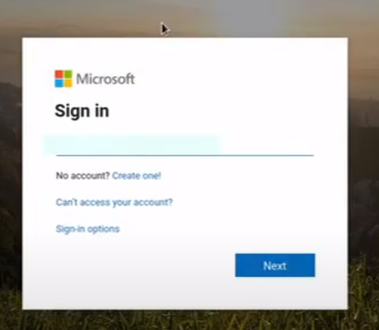
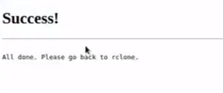
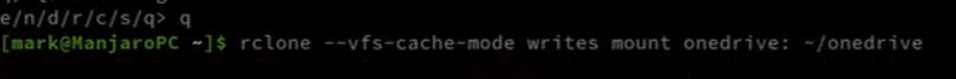

## Install RClone

```sh
curl https://rclone.org/install.sh | sudo bash
```

Then when it's done installing, execute the following command:

```sh
rclone config
```





If at this point you can't open a browser because you're in a terminal then don't worry, there is a way around this. 

!!!
[Open browser with `X11 Forwarding`](x11forwarding.md)
!!!






But to let the command run every time the server start, add the command to `/etc/rc.d/rc.local`

```sh
nano /etc/rc.d/rc.local
```

Add the following command to the end of the file, where `one` is the name you have the share in step 2 and `/var/one` is where you want your onedrive to mount.


```sh
# /etc/rc.d/rc.local
rclone --vfs-cache-mode writes mount one: /var/one
```