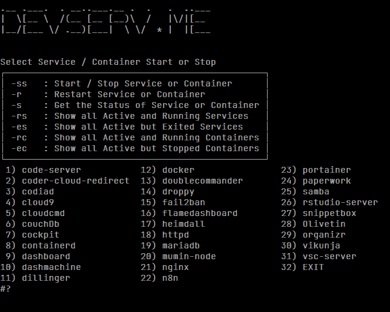

# Bash Scripts: Service menu

> Stopping and starting services and docker containers can be a pain, so i created a script to make it less irritating and boring to do.

## Use the service-menu (sm)

```shell
# I added the folder where I saved all my scripts to the PATH
# So just enter the following:
service-menu or sm
```

Something that looks like this or something close to this will be displayed


